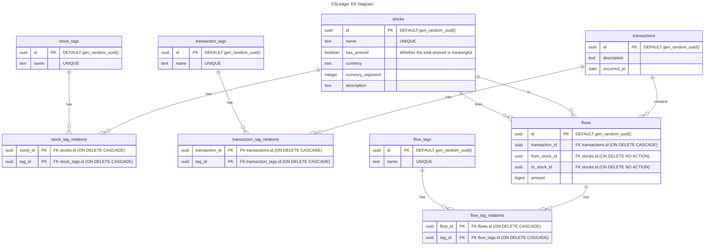

# FSLedger

A highly customizable personal ledger based on the Flow &amp; Stock model.

## ToDo
- DB indexing
- Multi User & Login System

## Memo

- Store the currency exponent with the currency, and use it to scale the integer amount for display in the UI.

## Database

All columns are `NOT NULL`, and empty strings (`""`) are used in some text columns.
If a user wants to delete a stock record, they must select a fallback stock for any flows that currently use it.

