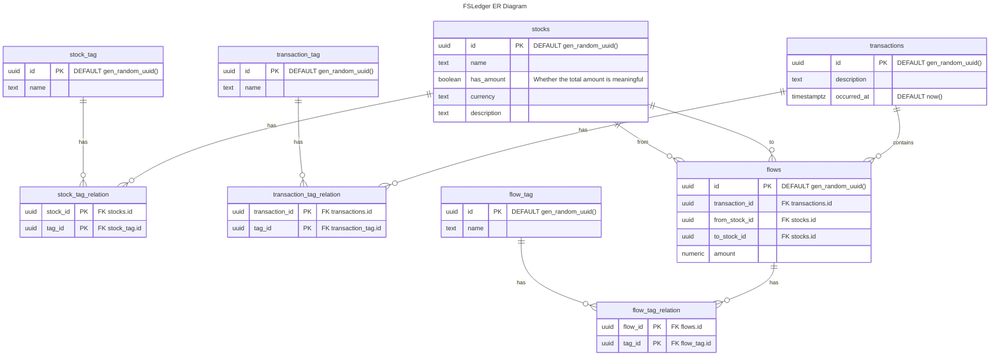

# FSLedger

A highly customizable personal ledger based on the Flow &amp; Stock model.

## Database

All columns are `NOT NULL`, and empty strings (`""`) are used in some text columns.

```mermaid
---
title: "FSLedger ER Diagram"
---

erDiagram
    stocks{
        uuid id PK "DEFAULT gen_random_uuid()"
        text name
        boolean has_amount "Whether the total amount is meaningful"
        text currency
        text description
    }

    stock_tag{
        uuid id PK "DEFAULT gen_random_uuid()"
        text name
    }

    stock_tag_relation{
        uuid stock_id PK "FK stocks.id"
        uuid tag_id PK "FK stock_tag.id"
    }
    
    transactions{
        uuid id PK "DEFAULT gen_random_uuid()"
        text description
        timestamptz occurred_at "DEFAULT now()"
    }

    transaction_tag{
        uuid id PK "DEFAULT gen_random_uuid()"
        text name
    }

    transaction_tag_relation{
        uuid transaction_id PK "FK transactions.id"
        uuid tag_id PK "FK transaction_tag.id"
    }

    flows{
        uuid id PK "DEFAULT gen_random_uuid()"
        uuid transaction_id "FK transactions.id"
        uuid from_stock_id "FK stocks.id"
        uuid to_stock_id "FK stocks.id"
        numeric amount
    }

    flow_tag{
        uuid id PK "DEFAULT gen_random_uuid()"
        text name
    }

    flow_tag_relation{
        uuid flow_id PK "FK flows.id"
        uuid tag_id PK "FK flow_tag.id"
    }

    stocks ||--o{ stock_tag_relation : has
    stock_tag ||--o{ stock_tag_relation : has

    transactions ||--o{ transaction_tag_relation : has
    transaction_tag ||--o{ transaction_tag_relation : has

    flows ||--o{ flow_tag_relation : has
    flow_tag ||--o{ flow_tag_relation : has

    transactions ||--o{ flows : contains
    stocks ||--o{ flows : "to"
    stocks ||--o{ flows : "from"
```
